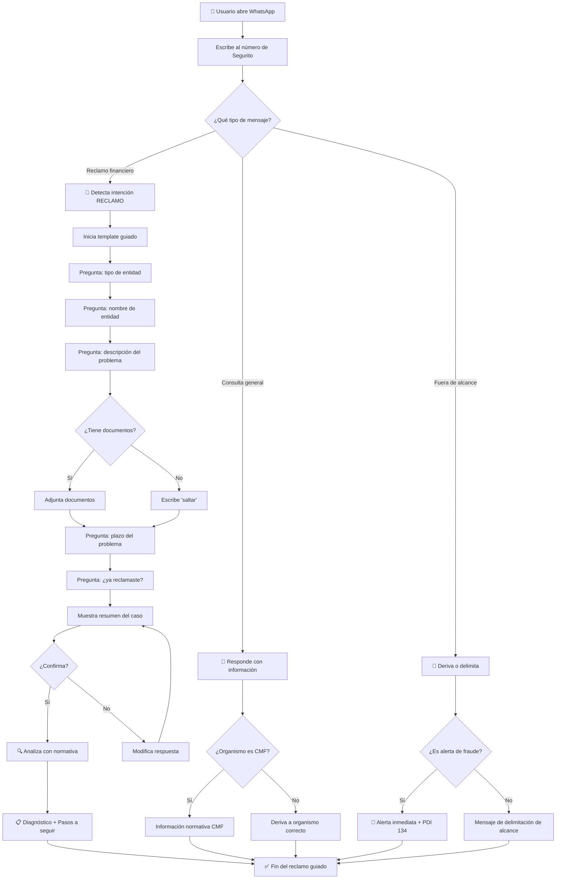
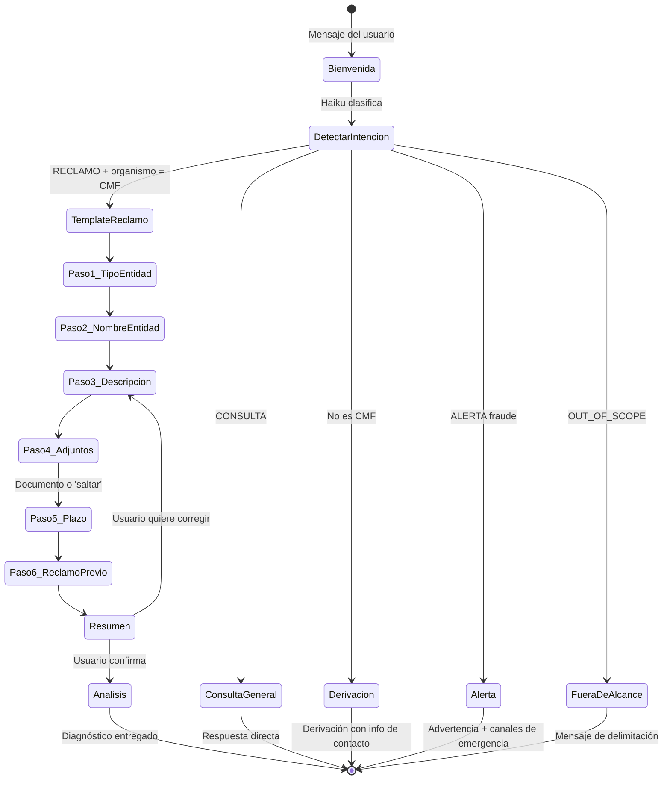
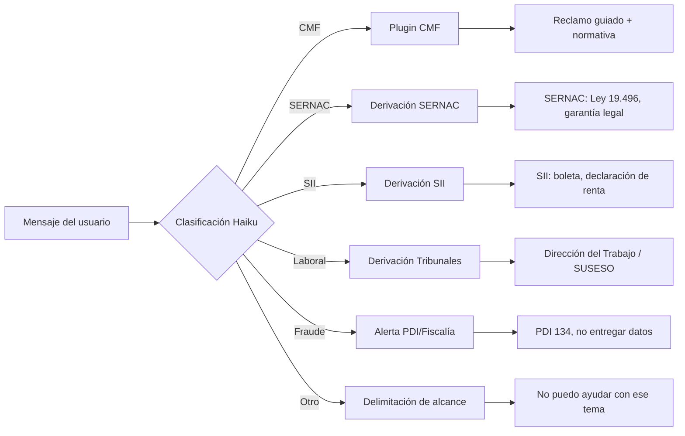

# Diagrama de Flujo del Usuario

Flujo completo desde la perspectiva del ciudadano que usa Segurito por WhatsApp.

## Diagrama general

## Flujo detallado de reclamo CMF

## Flujo de derivación por organismo

## Tiempos estimados por paso

| Paso | Acción | Tiempo estimado |
|---|---|---|
| Bienvenida | Bot responde en 2-3 seg | 3s |
| Tipo entidad | Usuario selecciona | 5s |
| Nombre entidad | Usuario escribe | 10s |
| Descripción | Usuario escribe | 15s |
| Adjuntos | Sube foto o salta | 10s |
| Plazo | Usuario selecciona | 5s |
| Reclamo previo | Usuario responde sí/no | 5s |
| Confirmación | Usuario confirma | 3s |
| Análisis backend | Procesa con normativa | 5-10s |
| **Total estimado** | | **~60-90s** |