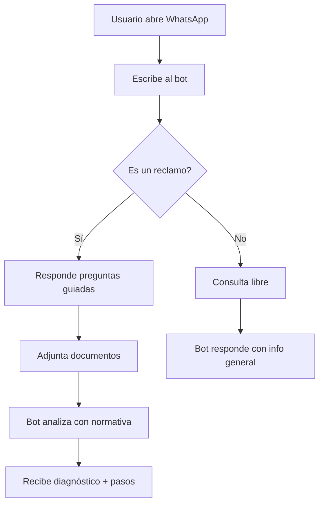

# Track C — Documentación, Datos y Demo Script

## Objetivo
Preparar todo el material no-código que el equipo necesita para entender el flujo, probarlo y presentarlo. Ideal para el dev de apoyo con menos experiencia técnica.

## Responsable
Dev de apoyo (documentación, organización, presentación).

## Archivos a crear

### 1. `docs/flujo-reclamo-cmf.md`

Guía visual del flujo paso a paso para el ciudadano. Debe poderse leer en 2 minutos.

Estructura sugerida:
- Título: "Cómo usar Segurito para un reclamo CMF"
- Paso 1: "Abre WhatsApp y escribe al número del asistente"
- Paso 2-9: Cada paso del template con screenshot de ejemplo (ASCII art o descripción).
- "Qué pasa después": explica que el asistente entrega un diagnóstico con normativa y pasos.
- "Si no es CMF": explica la derivación a SERNAC/SII/tribunales.

### 2. `docs/temas-preguntas-frecuentes.md`

20 preguntas de prueba con respuestas esperadas para validar el MVP.

Estructura:
```markdown
| # | Pregunta del usuario | Organismo esperado | Intención esperada | Qué debe responder |
|---|---|---|---|---|
| 1 | "me cobraron de más en la tarjeta" | CMF | RECLAMO_PRODUCTO | Explicar pasos: reclamar al banco, luego CMF |
| 2 | "mi seguro no me quiere pagar" | CMF | RECLAMO_SERVICIO | Circular CMF, SERNAC si es retail |
| ... | ... | ... | ... | ... |
```

### 3. `docs/diagrama-flujo-usuario.md`

Mermaid diagram o descripción textual del flujo desde la perspectiva del ciudadano.



### 4. `demo/script-demo.md`

Guión exacto para la presentación de 5 minutos.

Estructura sugerida:
```markdown
# Demo Script — Segurito WhatsApp (5 minutos)

## Setup previo (2 min antes de presentar)
- [ ] Backend levantado en localhost:8000
- [ ] Bridge levantado, QR ya escaneado, sesión activa
- [ ] Teléfono de prueba con WhatsApp abierto

## Intro (30 segundos)
"Chile tiene la regulación fintech más avanzada de Latinoamérica, pero 5 millones de chilenos no saben cómo ejercer sus derechos. Segurito es un asistente conversacional que traduce la normativa CMF al lenguaje ciudadano."

## Caso 1: Reclamo de cobro indebido (2 min)
1. Enviar: "me cobraron de más en mi tarjeta del banco estado"
2. Esperar bienvenida + pregunta de tipo de entidad
3. Responder: "banco"
4. Seguir flujo hasta resumen
5. Mostrar respuesta final con normativa

## Caso 2: Derivación a SERNAC (1 min)
1. Enviar: "me vendieron un celular defectuoso en una tienda"
2. Esperar respuesta: "Este caso corresponde a SERNAC..."

## Caso 3: Out of scope (1 min)
1. Enviar: "quiero pedir una pizza"
2. Esperar: "Soy Segurito, asistente de organismos del Estado..."

## Cierre (30 segundos)
"En 8 horas construimos un puente entre la normativa y el ciudadano."
```

### 5. `data/demo/casos-reclamo.json`

Casos de prueba curados en JSON para cargar rápido durante desarrollo.

Estructura:
```json
[
  {
    "nombre": "Cobro indebido tarjeta",
    "mensaje_inicial": "me cobraron 50.000 pesos que no reconozco en mi tarjeta del banco estado",
    "respuestas_template": {
      "tipo_entidad": "tarjeta de crédito",
      "nombre_entidad": "Banco Estado",
      "descripcion": "Cobro de 50.000 CLP no reconocido en estado de cuenta de abril",
      "plazo": "1-3 meses",
      "reclamo_previo": "No he reclamado"
    },
    "respuesta_esperada_keywords": ["Circular CMF", "Ley 19.496", "reclamar al banco", "CMF Online"]
  }
]
```

### 6. `docs/arquitectura-slide.md`

Un slide de arquitectura en formato Markdown que pueda copiarse a Google Slides o presentarse como texto.

Contenido:
- 3 bloques: Usuario → Bridge (Node.js) → Backend (Python/FastAPI)
- Flechas con protocolos (WhatsApp Web ↔ Bridge = wwebjs, Bridge ↔ Backend = HTTP/JSON)
- Badges de tecnologías: whatsapp-web.js, FastAPI, Anthropic, ChromaDB

## Glosario para no-técnicos

Crear `docs/glosario.md` con definiciones simples:
- **WhatsApp Web**: versión de WhatsApp que corre en el navegador.
- **Bridge**: programa que conecta WhatsApp con el cerebro del bot.
- **Backend**: el cerebro, donde está la inteligencia artificial.
- **Template**: guion de preguntas que hace el bot paso a paso.
- **RAG**: sistema que busca en leyes y documentos para dar respuestas precisas.

## Checklist de entrega

- [ ] `flujo-reclamo-cmf.md` puede entenderse en 2 minutos por alguien externo.
- [ ] `temas-preguntas-frecuentes.md` tiene al menos 20 casos.
- [ ] `script-demo.md` tiene tiempos asignados y no excede 5 minutos.
- [ ] `casos-reclamo.json` tiene al menos 5 casos completos.
- [ ] `arquitectura-slide.md` es copiable a una presentación.

## Notas

- Este track no requiere saber programar. Se necesita entender el flujo del usuario y escribir claro.
- Si hay dudas sobre qué responde el backend en cada caso, preguntar al dev del Track B o probar con `python -m backend.cli`.
